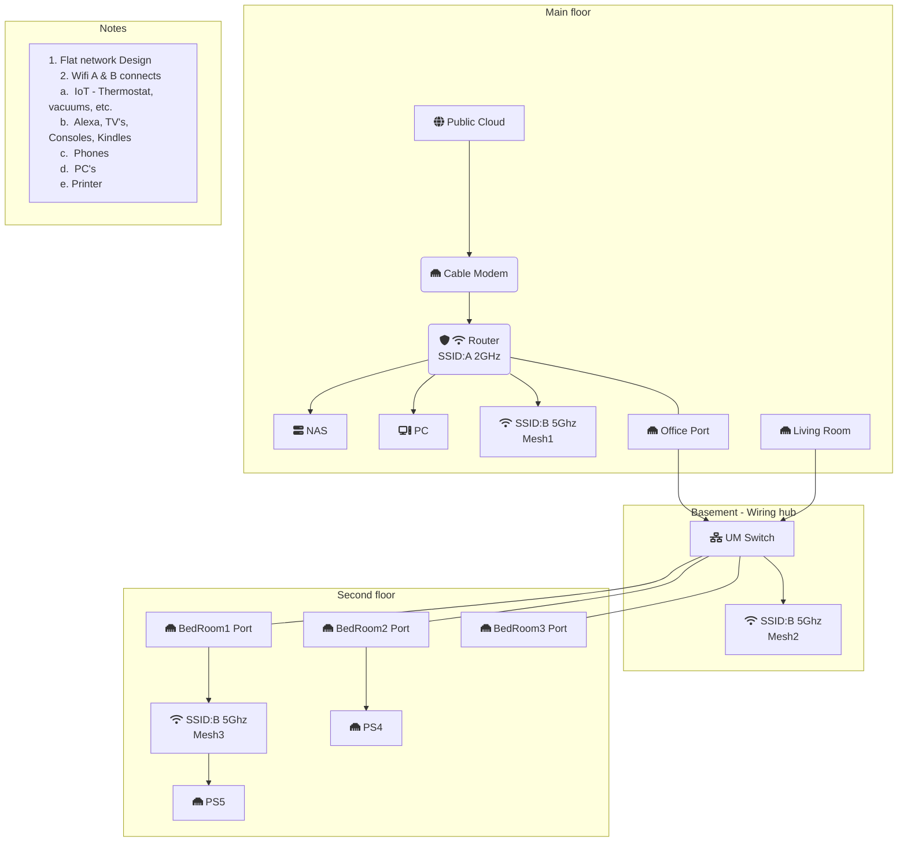

# Home Network (Current)

Current home network with goal of moving to more controlled VLAN/Firewall architecture within physical constraints.

```mermaid
flowchart TD
    subgraph Main floor
    INET[fa:fa-globe Public Cloud] --> CM(fa:fa-ethernet Cable Modem)
    CM --> RT(fa:fa-shield fa:fa-wifi  Router\nSSID:A 2GHz)
    RT -->NAS[fa:fa-server NAS]
    RT -->PC[fa:fa-computer PC]
    RT -->MESH1[fa:fa-wifi SSID:B 5Ghz\nMesh1]
    RT ---OFFICEEN[fa:fa-ethernet Office Port]
    LIVINGEN[fa:fa-ethernet Living Room]
    end
    subgraph Basement - Wiring hub
    OFFICEEN -->SWITCH[fa:fa-network-wired UM Switch]
    LIVINGEN -->SWITCH[fa:fa-network-wired UM Switch]
    SWITCH -->MESH2[fa:fa-wifi SSID:B 5Ghz\nMesh2 ]
    end
    subgraph Second floor
    SWITCH --- BR1EN[fa:fa-ethernet BedRoom1 Port]
    BR1EN -->MESH3[fa:fa-wifi SSID:B 5Ghz\nMesh3]
    MESH3 -->PS5[fa:fa-ethernet PS5]
    SWITCH --- BR2EN[fa:fa-ethernet  BedRoom2 Port]
    BR2EN -->PS4[fa:fa-ethernet PS4]
    SWITCH --- BR3EN[fa:fa-ethernet  BedRoom3 Port]
    end
  
    subgraph Notes
    AAA[1. Flat network Design
    2. Wifi A & B connects
    a.  IoT - Thermostat, vacuums, etc.
    b.  Alexa, TV's, Consoles, Kindles
    c.  Phones
    d.  PC's
    e. Printer
    ]
    style AAA text-align:left
    end
```
